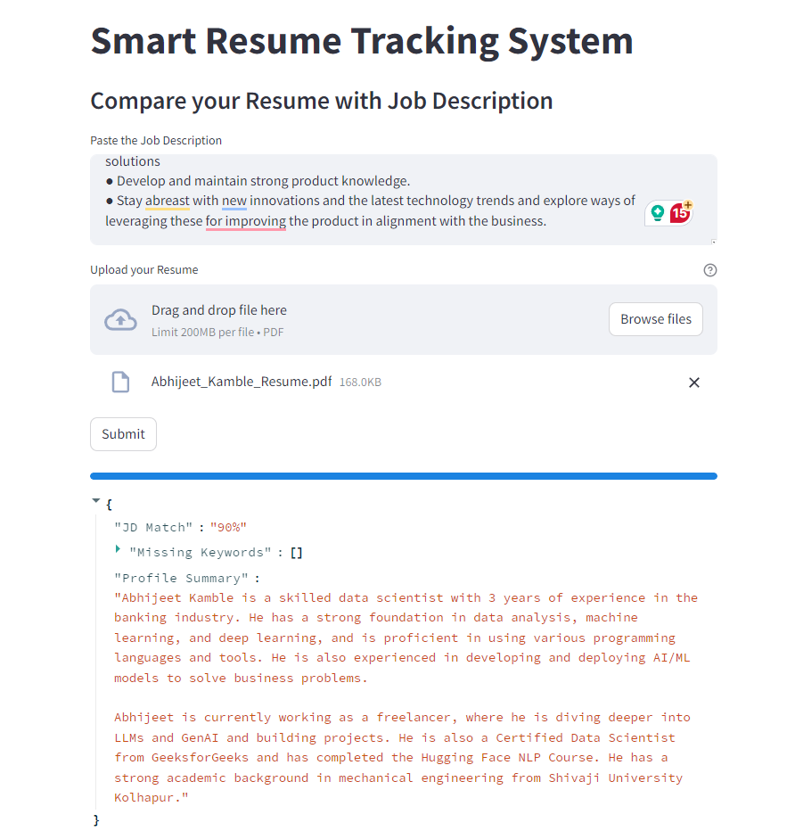

# Smart Resume Tracking System using Google Gemini Pro

The objective of this project is to create an Resume ATS leveraging power of LLM. I have used Google state-of-the-art Gemini Pro model to analyze the resume.

Python Packages used in this project:
1. Streamlit : For UI
2. PyPDF2 : To extract text from resume pdf
3. google.generativeai : To connect with Gemini Model API

Demo:
